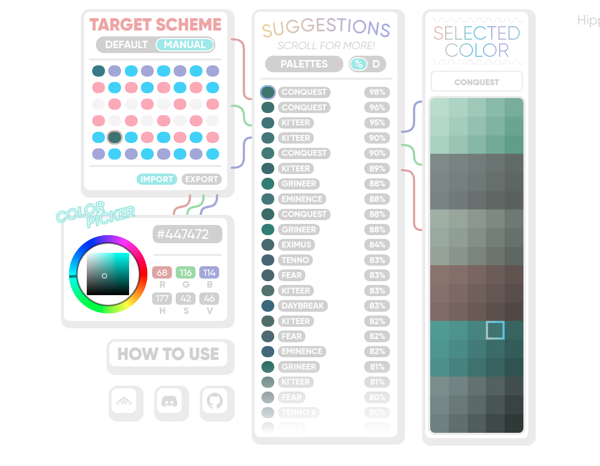

# What is Warframe Color Picker?

This tool is designed to help you with searching for specific colors across the in-game palettes. Not only it lets you find the closest colors, it also gives you an option to adjust the chosen color on the fly, changing its brightness, hue, or saturation!

Back in the day when this tool hadn't yet been a thing, in order to create an accurate in-game cosplay that is not hard on the eyes we had to manually compare more than 3000 colors scattered across more than 35 palettes, being limited to completely unrelated third-party software, to get a slightly brighter and less saturated version of the chosen color to match the scheme on a skin of choice. And oh my, texture / model entropy in this game is so high it sometimes was straight up impossible to predict how the same scheme would look on another object (doesn't matter whether it was a Warframe, a Weapon, or anything else). Yes, [the challenge was real](https://www.youtube.com/watch?v=KxRZX9eDpCs&feature=youtu.be&t=45). 

Despite all the pain, having an absolute copy of Nightwatch, or, say, Wolf of Saturn Six scheme on your Graxx skin was rewarding enough to keep getting back to it again and again, enduring the same obnoxious procedure over and over... After all, roleplay, fashion, and—as a result—immersion form the foundation of our envision of the true endgame!

Lucky for all of us, we've made an app that does this entire tiresome routine for you in a flash and automatically, without the need to manually grind your eyes through thousands of colors, needlessly memorising them all. Yay!! All hail the community!

We present this irreplaceable tool to all of you, fellow fashionframe enthusiasts:

https://avrorapolnareff.github.io/warframe-color-picker/

# What are the main features?
Here is the list of currently available most important features divided into sections, named accordingly.

### **COLOR PICKER**:

* Adjust the color selected in Target Scheme submenu
* Color Insertion
  * Insert your entire in-game palette via *manual uploading* / *using CTRL+V* from a screenshot;
  * Insert the HEX code of your color;
  * Insert the RGB or HSV values of your color
* Color Adjustment
  * Adjust your color using Color Wheel;
  * Adjust your color using R, G, B values;
  * Adjust your color using H, S, V values

### **TARGET SCHEME**:

* Select a color from your collection for editing in Color Picker submenu;
* Click right mouse button on a color to empty the slot;
* Switch between Default and Manual color schemes
* Default Scheme
  * Manage your colors as they're arranged in the original order, with the tips on the right (Primary, Secondary, Tertiary, etc.);
  * Chosen colors will be automatically transferred to the selected line in the Manual section
* Manual Scheme
  * Manage your colors using a custom order with a plethora of available slots, without the tips;
  * Selected horizontal line of colors will be automatically transferred to Default
* Import
  * Manually upload your entire scheme from a screenshot;
  * Insert the code generated with Export button
* Export
  * Copying the URL will contain all colors from both Default and Manual palettes. Sharing is caring!
  
### **SUGGESTIONS**:

* Find the closest color to the one selected in Target Scheme submenu
* % / (D)
  * Switch between a more user-friendly percent-based value, or switch to a raw (D)istance variable, if you think you're the nerdiest of them all! 
* Palettes Menu
  * Customize the list of palettes that are being displayed as suggestions (green = enabled; gray = disabled);
  * See the palette preview on the right to make sure it's... the right one!;
  * Disable all palettes (except Classic) to manually enable only the ones that you currently have one by one;
  * Enable all palettes if you want to see them all

### **SELECTED COLOR**:

* Find out where exactly the selected color from Suggestions is located
* (Palette Name)
  * Hover your mouse over a color to get its coordinates displayed in the palette name field (X, Y)

# Usage
